# Assignment 1 - ReactJS app.

Name: Zheng Dao Zhou

## Overview.

This is a React Web App demostrating some inforamation fetched from TMDB. This App provide users with some basic functions like searching,flitering, pagination, sorting etc and a simple login system.

### Features.

+ Pagination - Now every page that display a list of movie has pagination. You can switch between pages by clicking number buttons or directly go to certain page by using a selector.
+ Sorting - Now every page that display a list of movie can sort the content. There are two types of sorting, one is called "Top Rated" which sorts the movies by their rating and the other is "Lastest", it sorts the movies by their releasing date (and if the date is the same it will sort by their rating again).
+ Top Rated Page - This is a page displaying the top rated movies.
+ Popular Page - This a page displaying moives that are popular now.
+ Upcoming Page Enhanced - Now the button which adds the movie into a must-watch list actually works. And naturally there is a must-watch list page just like the favourite page, where you can remove movie from the must-watch list.
+ Login and Logout - You can use the user data of TMDB to login in this App. Once login, a greeting according to the username will be added in tilte and the login button will become a logout button.

## Setup requirements.

+ npm install @mui/material - the origin app uses @material-ui but something I needed is missing in this old version so I install this new version of material ui
+ npm install antd-mobile - used to build the login UI
+ npm install http-server@13.0.2 - do not install the lastest version of http server, it will cause the CI to fail

## API endpoints.

+ Get Top Rated Movies - movie/top_rated
+ Get Popular Movies - movie/popular
+ Request Authentication Token - authentication/token/new
+ Authentication User - authentication/token/validate_with_login
+ Request Session - authentication/session/new
+ Get Account Detail - account

## App Design.

### Component catalogue.
Since the most change is done within components that already existed, there is not too much to represent in story book.
### UI Design.
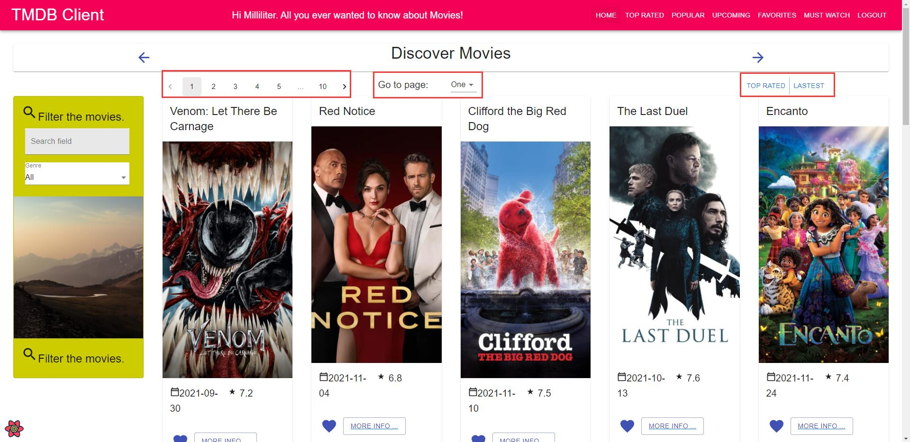

>The Home Page, Popular Movies Page, Top Rated Movies Page and Upcoming Page basicly have the same layout. The parts marked in red square is the part I added. The Left two parts are used to do pagination and the right part is to sort the movies.

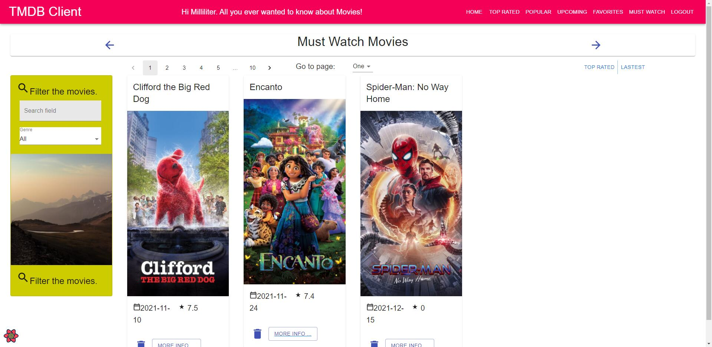

>The Favorites Page and Must Watch Page also have the same layout. Their movie cards both have a delete botton that can remove this movie from their own list.

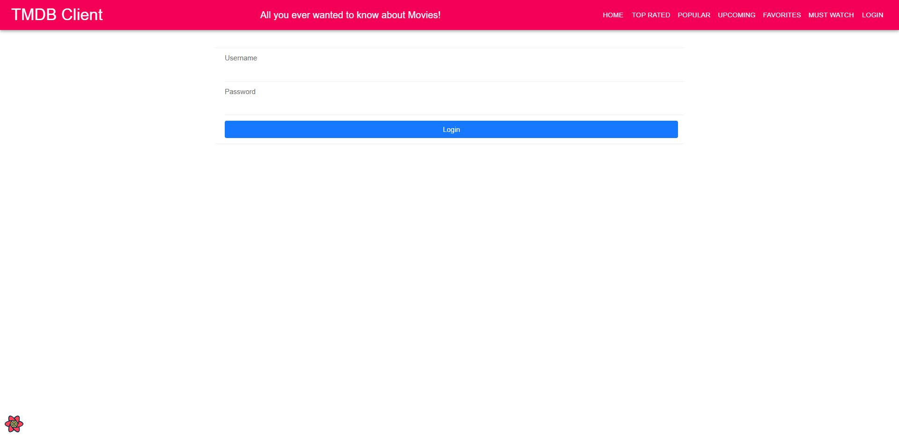
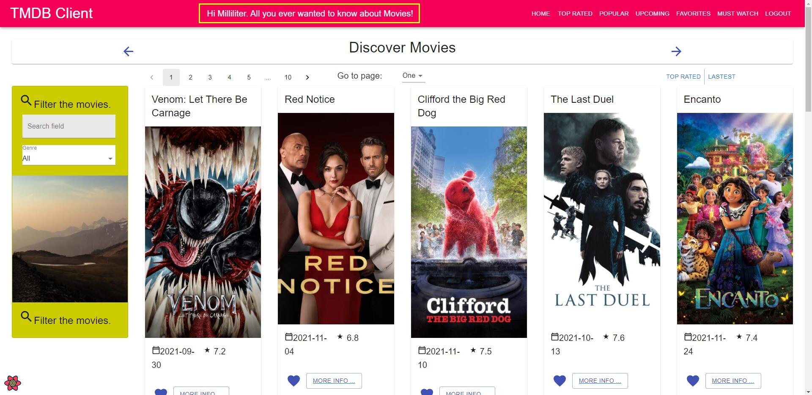
>The Login Page is pretty simple. There will be a little pop up window to tell the user the login is successful or not after login. The title will change once the user logined and the "Login" button will become "Logout".

## Routing.

+ /movies/topRated - displays all top rated movies.
+ /movies/popular - displays all popular movies.
+ /movies/mustWatch - displays all the movies that are tagged must-watch in upcoming page.
+ /movies/login - let user to login with TMDB account.

## Independent learning.

+ The Pagination part in /src/components/templateMovieListPage/index.js.
I learnt by the api provided by material ui : https://mui.com/api/pagination/
+ The Login part in /src/pages/loginPage.js I learnt by watching a youtube video : https://www.youtube.com/watch?v=Sd2WJ6mzNPE (Also with tons of search but I did not remenber all the article I have read)

# Assignment 1 - Agile Software Practice.
Name: Zheng Dao Zhou

## App Features.

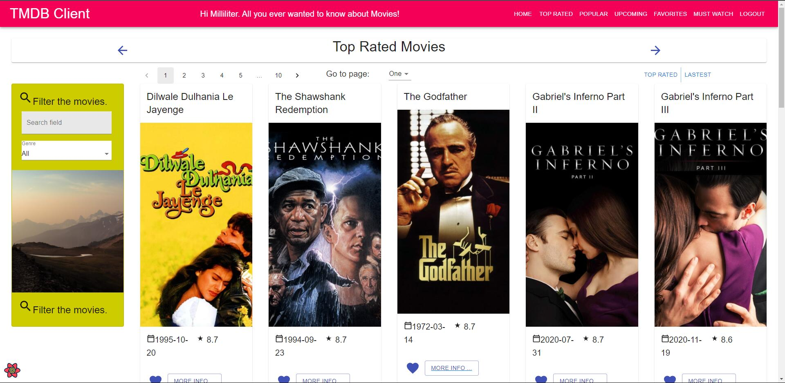
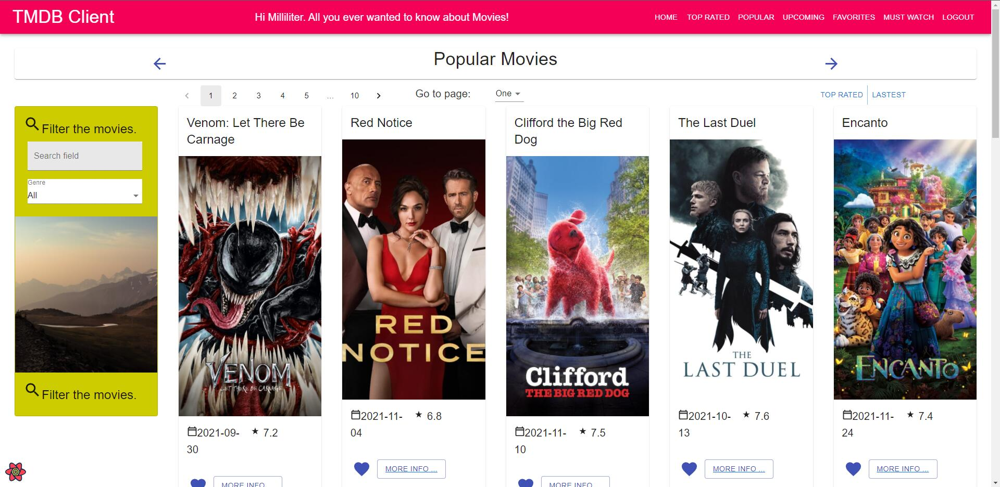
>Home Page/Top Rated Page/Popular Page - Display some movies. Movies can be filtered by title or gerne. There are pagination and sorting functions. You can add certain movie to favorite list.

Tests: cypress/integration/home-page.spec.js, cypress/integration/topRated-page.spec.js, cypress/integration/popular-page.spec.js

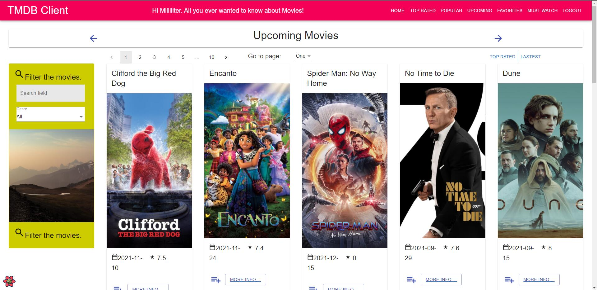
>Upcoming Page - Display some movies. Movies can be filtered by title or gerne. There are pagination and sorting functions. You can add certain movie to must watch list.
Tests: cypress/integration/upcoming-page.spec.js

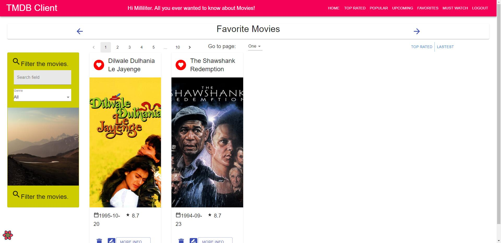
>Favorite Page - Display your favourite movies. Movies can be filtered by title or gerne. There are pagination and sorting functions. You can remove certain movie from favorite list.
Tests: cypress/integration/favorite-page.spce.js

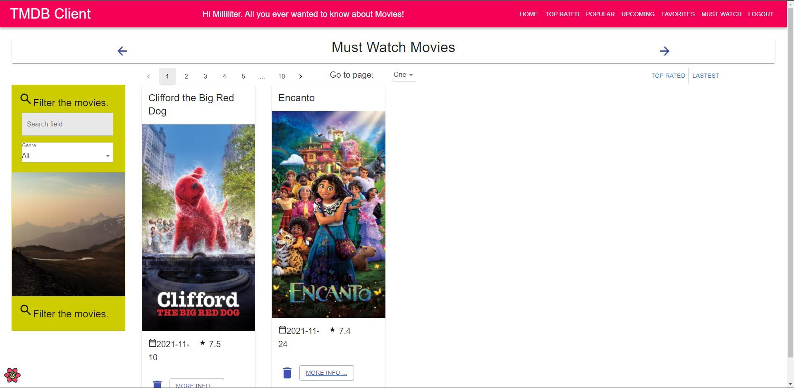
>Favorite Page - Display your must-watch movies. Movies can be filtered by title or gerne. There are pagination and sorting functions. You can remove certain movie from must watch list.
Tests: cypress/integration/mustWatch-page.spec.js

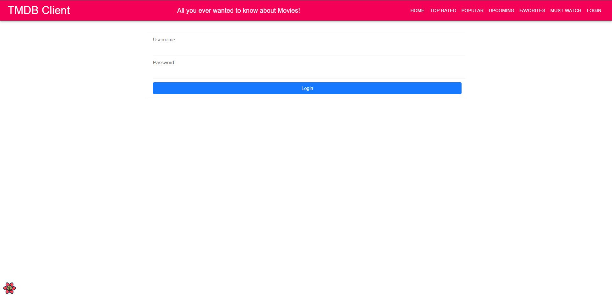
>Login Page - Let user login using TMDB account. Once logined, the welcome tilte and the "Login" will change.
Tests: cypress/integration/login-page.spce.js

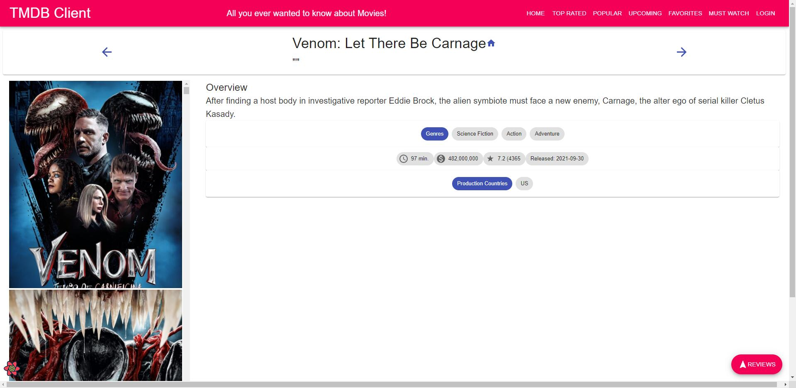
>Moive Detail Page - Display movie details. User can add reviews to movie.
Tests: cypress/integration/movieDetails-page.spec.js

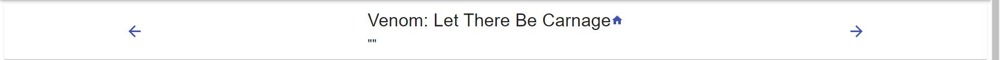
>Navigation Part - Let user visit the page they viewd perviously by simply click buttons.
Tests: cypress/integration/navigation.spec.js

## Testing
GitLab CI URL : https://gitlab.com/Milliliter/asp-assignment-1/-/pipelines